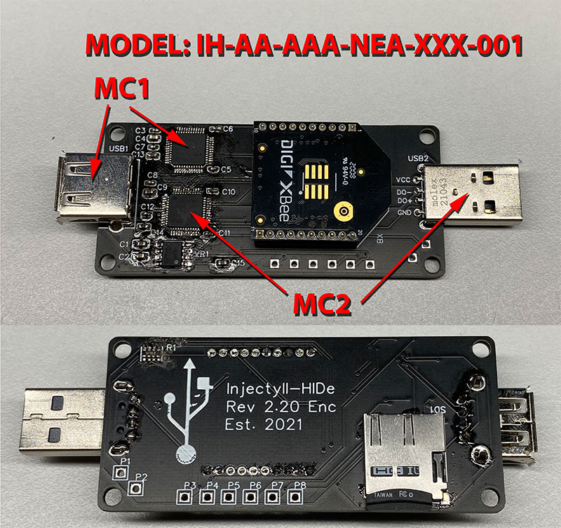

# Injectyll-HIDe Implant
Here is the documentation on the implant board related information specifically.

## Table of Contents

1) [Implant Part Number Breakdown](https://github.com/c4m0ufl4g3/sample/tree/main/Implant#implant-part-number-breakdown)

2) [Implant Visual Identification](https://github.com/c4m0ufl4g3/sample/tree/main/Implant#implant-part-number-breakdown)

3) [Programming the Implant](https://github.com/c4m0ufl4g3/sample/tree/main/Implant#programming-the-implant)
    1) [Download and Install Arduino](https://github.com/c4m0ufl4g3/sample/tree/main/Implant#download-and-install-arduino)
    2) [MC1 Programming](https://github.com/c4m0ufl4g3/sample/tree/main/Implant#mc1-programming)
    3) [MC2 Programming](https://github.com/c4m0ufl4g3/sample/tree/main/Implant#mc2-programming)
    4) [Special Notes](https://github.com/c4m0ufl4g3/sample/tree/main/Implant#special-notes)

4) [Vendor ID and Product ID](https://github.com/c4m0ufl4g3/sample/tree/main/Implant#vendor-id-and-product-id)
    1) [Identifying a device VID/PID](https://github.com/c4m0ufl4g3/sample/tree/main/Implant#identifying-a-device-vidpid)
        1) [Windows Device Manager](https://github.com/c4m0ufl4g3/sample/tree/main/Implant#windows-device-manager)
        2) [PowerShell](https://github.com/c4m0ufl4g3/sample/tree/main/Implant#powershell)
    2) [Changing VID/PID with Arduino](https://github.com/c4m0ufl4g3/sample/tree/main/Implant#changing-vidpid-with-arduino)

5) [Flashing the Bootloader](https://github.com/c4m0ufl4g3/sample/tree/main/Implant#flashing-the-bootloader)
    1) [Required Materials](https://github.com/c4m0ufl4g3/sample/tree/main/Implant#required-materials)
    2) [Pin Out](https://github.com/c4m0ufl4g3/sample/tree/main/Implant#pin-out)
    3) [Bootloader Procedure](https://github.com/c4m0ufl4g3/sample/tree/main/Implant#bootloader-procedure)
    4) [References](https://github.com/c4m0ufl4g3/sample/tree/main/Implant#references)

6) [Memory](https://github.com/c4m0ufl4g3/sample/tree/main/Implant#memory)
    1) [Communication](https://github.com/c4m0ufl4g3/sample/tree/main/Implant#communication)
    2) [File System](https://github.com/c4m0ufl4g3/sample/tree/main/Implant#file-system)

7) [Additional References](https://github.com/c4m0ufl4g3/sample/tree/main/Implant#additional-references)

## Implant Part Number Breakdown
<pre>
                    IH-___ ___ - ___ ___ ___ - ___ ___ ___ - ___ ___ ___ - ___ ___ ___  
                        |   |     |   |   |     |   |   |     |_______|     |_______|  
Micro Controller 1 ------   |     |   |   |     |   |   |         |             |  
A - SAMD21                  |     |   |   |     |   |   |         |             |  
X - None                    |     |   |   |     |   |   |         |             |  
                            |     |   |   |     |   |   |         |             |  
Micro Controller 2-----------     |   |   |     |   |   |         |             |  
A - SAMD21                        |   |   |     |   |   |         |             |  
X - None                          |   |   |     |   |   |         |             |  
                                  |   |   |     |   |   |         |             |  
Radio Option ----------------------   |   |     |   |   |         |             |  
A - Digi XBee Through-Hole            |   |     |   |   |         |             |  
B - Digi Micro Radio                  |   |     |   |   |         |             |  
C - Digi SMT Radio                    |   |     |   |   |         |             |  
                                      |   |     |   |   |         |             |  
Memory Option -------------------------   |     |   |   |         |             |  
A - MicroSD Card                          |     |   |   |         |             |  
                                          |     |   |   |         |             |  
Connector Option --------------------------     |   |   |         |             |  
A - USB-A Through Hole                          |   |   |         |             |  
                                                |   |   |         |             |  
External Crystal for Chips ----------------------   |   |         |             |  
C - 32 MHz Crystal                                  |   |         |             |  
N - No External Cyrstal                             |   |         |             |  
                                                    |   |         |             |  
Enclosure -------------------------------------------   |         |             |  
E - Enclosure Mounts                                    |         |             |  
N - No Enclosure Mounting                               |         |             |  
                                                        |         |             |  
SWD Pin Option ------------------------------------------         |             |  
A - Through-Hole                                                  |             |  
B - Std Connector                                                 |             |  
C - Both TH and Std                                               |             |  
N - None                                                          |             |  
                                                                  |             |  
Additional Options ------------------------------------------------             |  
XXX - None                                                                      |  
                                                                                |  
Revision ------------------------------------------------------------------------  
</pre>

## Implant Visual Identification
IH-AA-AAA-CNC-XXX-001


IH-AA-AAA-NEA-XXX-001



IH-AA-AAA-NNA-XXX-001


## Programming the Implant

This guide will walk you through programming the MC1 and MC2 chips on the implant to get it operational.

### Download and Install Arduino

1) Download and install Arduino IDE (https://www.arduino.cc/en/software)
2) Install Board Package
    - Go to: "Tools" -> "Board:<Board Name Here>" -> "Boards Manager" 
    - Install the appropriate boards: Arduino SAMD Boards (32-bits ARM Cortex-M0+)

### MC1 Programming

This section will walk through programming the MC1 chip.  This chip is used to read in HID packets from a device and relay the translated packets to MC2.

1) Connect the implant over USB to the MC1 chip on the implant using the corresponding USB Connector (USB1).

    - In one small run of boards (REV 2.30) this was labeld as USB2 by error.
	
2) Open the MC1 code

3) Select Board

    - Go to: "Tools" -> "Board:<Board Name Here>" -> Arduino SAMD Boards (32-bits ARM Cortex-M0+) -> "Arduino NANO 33 IoT"
	
4) Select COM Port of connected board

    - Go to: "Tools" -> "Port" -> <appropriate port #>
	
5) Compile and Upload the code

    - Compile the code with either the Check icon or by going to "Sketch" -> "Verify/Compile"
	
6) Upload code

    - Upload using the right arrow icon or by goint to "Sketch" -> "Upload"
	
### MC2 Programming

This section will walk you through programming the MC2 chip.  This chip sends out keystrokes as well as interfaces with the radio, memory unit, and MC1.

1) Connect the implant over USB to the MC2 chip on the implant using the corresponding USB Connector (USB2).

    - In one small run of boards (REV 2.30) this was labeld as USB1 by error.
	
2) Open the MC2 code

3) Update any mode passwords/codes used for operations if applicable

4) Save file

5) Select Board

    - Go to: "Tools" -> "Board:<Board Name Here>" -> Arduino SAMD Boards (32-bits ARM Cortex-M0+) -> "Arduino NANO 33 IoT"
	
6) Select COM Port of connected board

    - Go to: "Tools" -> "Port" -> <appropriate port #>
	
7) Compile and Upload the code

    - Compile the code with either the Check icon or by going to "Sketch" -> "Verify/Compile"
	
8) Upload code

    - Upload using the right arrow icon or by goint to "Sketch" -> "Upload"

### Special Notes
There exists a scenario on Windows machines where the HID driver will not launch properly if the Arduino NANO 33 IoT drivers are already installed.

This scenario is common when programming a device on a new Windows machine for the first time.

It is recommended that the VID/PID settings are changed (see the VID/PID Guide) on the implant to avoid this scenario on the target.

If the HID funcitonality is not properly working on the implant:

1) Open device manager

2) Locate the "Arduino NANO 33 IoT" device under COM devices. It should have a warning symbol next to it.

3) Right-click on the device and choose "Unistall Device."

4) When prompted, click on the "Unistall Drivers" box and click continue.

5) Disconnect and then reconnect the implant device.

6) It should now operate as desired.

## Vendor ID and Product ID

The vendor ID (VID) and the product ID (PID) are used to identify USB devices when they connect to a host.  By spoofing these, we can trick the host into thinking we are a regular USB device. You will want to capture the VID/PID of the device you want to mimic.

Once you have a VID/PID that you want to mimic, the next step is to change the boards.txt file for the Arduino IDE to the desired config.  Once you upload the program to the SAMD chip, it will have the new VID/PID assigned to it.

### Identifying a device VID/PID

#### Windows Device Manager
1) Open Device Manager
2) Open Keyboards section
3) Locate at currently listed keyboard and note any VID/PID values by right-clicking and selecting "Properties"
4) Plug device in and wait for the list to repopulate
5) Check all Keyboards again for a newly listed device and record the VID/PID values

#### PowerShell
1) Download the usb_identify.ps1 script from the repo
2) Open it with Windows Powershell ISE
3) Run the Powershell command:
    ```powershell
        get-pnpdevice -class Keyboard,USB,Display,Mouse -Status OK | Select-Object -Property InstanceId,FriendlyName	
	```
4) Record the output from the command
5) Plug in the device into the computer
6) Rerun the command and look for the device that was added
7) Record that VID/PID  

### Changing VID/PID with Arduino
Note: This file needs to be modified prior to launching the Arduino IDE and programming the board.
      If the file is modified while the IDE is opened, the IDE will have to be relaunched for the new settings to be loaded.
1) Go to:
    > "%UserProfile%\AppData\Local\Arduino15\packages\arduino\hardware\samd"
2) Enter next folder
3) Locate boards.txt
4) make a copy of boards.txt before modifying it  

        example: boards-org.txt
5) Open boards.txt to edit
6) Search for "IoT"
7) Change the following settings under "# Arduino NANO 33 IoT":

    - nano_33_iot.build.usb_product="Arduino NANO 33 IoT"  
        This modifies the name display on pop-ups when the device is setting up
    - nano_33_iot.build.usb_manufacturer="Arduino LLC"  
        This modifies the recorded manufacturer info.
    - nano_33_iot.build.vid=0x2341  
        This modifies the Vendor ID of the SAMD chip once reprogrammed  
    - nano_33_iot.build.pid=0x8054  
        This modifies the Product ID of the SAMD chip once reprogrammed   

******Note:*** *If using a prebuilt board with external crystals:* ***
1) Locate the following line in boards.txt
    - nano_33_iot.build.extra_flags=-DCRYSTALLESS -D__SAMD21G18A__ {build.usb_flags}
2) remove -DCRYSTALLESS poriton of the flag if using the board from the vendor to allow for external crystals

## Flashing the Bootloader

This article will cover how to flash the arduino bootloader onto MC1 and MC2.

### Required Materials

1) Implant board with both chips
2) Segger J-Link EDU programmer
3) Omilex JTAG adapter
4) SWD Adpater
5) Host computer running Microchip Atmel Studio

### Pin Out

- P1 = 3 VDC
- P2 = GND
- P3 = SWCLK (MC1)
- P4 = SWDIO (MC1)
- P5 = Reset (MC1)
- P6 = SWCLK (MC2)
- P7 = SWDIO (MC2)
- P8 = Reset (MC2)

### Bootloader Procedure
Under construction...

### References

This is a useful guide that we initially followed.

https://www.instructables.com/ATSAMD21g18-Bootloader-With-J-link-Debugger/

## Memory

For our initial project release, we are using a Micro SD card for storage.  

### Communication
Communication with the Micro SD card is done over SPI using a standard Arduino library.

### File System
The memory should be formatted as FAT16 or FAT32.

The appropriate file system will be created on the card when a file is created on it, so the card can be blank to start.

- Scripts are stored in the "/SCRIPTS/" folder

- Keystroke records are stored in the "/DATA/" folder

## Additional References

- https://www.arduino.cc/reference/en/libraries/sd/  

- https://learn.sparkfun.com/tutorials/adding-more-sercom-ports-for-samd-boards/all  


