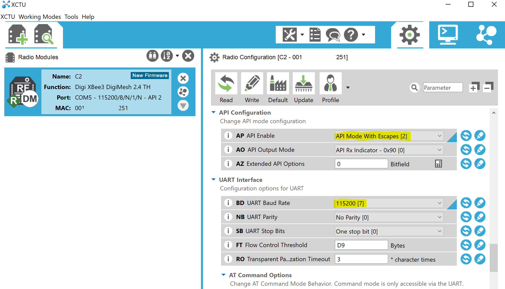

# XCTU and Radio Setup

This guide will walk you through setting up the XBee radios for use with the implant.
## Required Components

- Digi XBee radio (https://hub.digi.com/support/products/digi-xbee/digi-xbee3/)
- USB adapter for radio (https://www.sparkfun.com/products/11697)
- Host computer

## XCTU

XCTU is an interface from Digi that allows you to configure the radios.

1) Download XCTU from Digi International (https://hub.digi.com/support/products/xctu/)
2) Install XCTU
3) Launch XCTU
4) Connect the Digi radio and its USB dongle
5) Click on the Radio+ icon to connect to the radio
6) If the radio is already detected, use the prepopulated option.
   Otherwise:
        1) Locate the radio COM port in the Device Manager
        2) Verify the COM settings
        3) Enter the setting manually in XCTU
7) Click on the discovered radio to populate its configuration
8) Change the "API Configuration" to "API Mode With Escapes [2]"
9) OPTIONAL: A recommended BD UART Baud Rate is 115200
10) Change device,network, and encryption configurations as desired.

